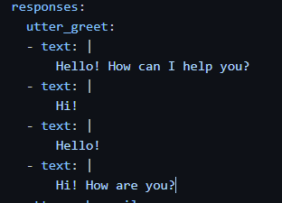
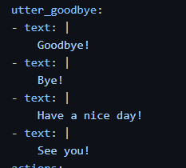
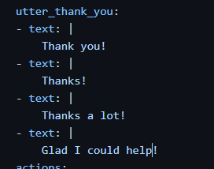

# seg3125_lab10
## Report

Add at least 4 training sentences for the greet intent already defined.

Define a new Thank You intent for which you will define at least 4 training examples.

Define a new Goodbye intent for which you will define at least 4 training examples

